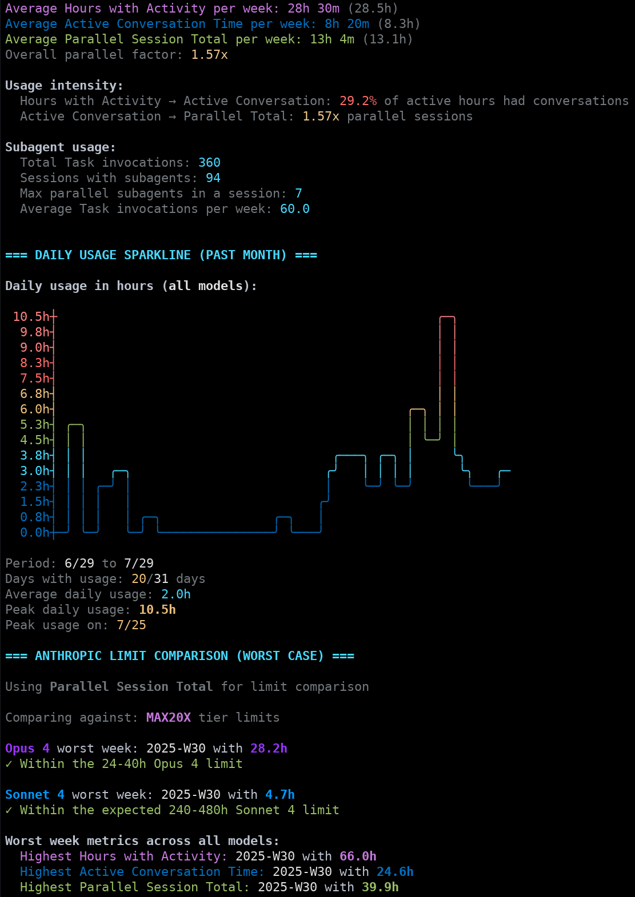

# cc-usage-hours

Analyze Claude Code usage from session data in `~/.claude/projects`.

Anthropic announced the new weekly limits with vague assurances about how many hours of usage an 'average user' would get.
This tool is designed to help you estimate your usage in 'hours', and figure out how likely you are to run into limits.

To that end, it computes 3 different ways of measuring your usage in 'hours':

### Metrics
- **Hours with Activity**: Hours in which you used Claude Code at least once
- **Active Conversation Time**: Duration of time during which you were interacting with Claude Code
- **Parallel Session Total**: Sum of durations of all sessions, accounting somewhat for parallel usage.

Note that the parallel session total seems lower than expected, and so is probably only accounting for parallel *sessions*, not fully accounting for subagents.



## Install

```bash
npm install -g cc-usage-hours
```

## Or run directly via npx
```bash
npx cc-usage-hours
```

## Usage

```bash
cc-usage-hours                # Auto-detect subscription
cc-usage-hours -s pro         # Specify subscription
cc-usage-hours -t active      # Use active time metric for limits
cc-usage-hours -w             # Show weekly breakdown
cc-usage-hours -m             # Show model breakdown
cc-usage-hours -m opus        # Show only Opus usage
```

## Options

- `-g, --gap <minutes>` - Inactivity before new session (default: 5)
- `-s, --subscription` - Subscription: pro, max5x, max20x (default: auto)
- `-t, --metric <type>` - Limit comparison: hours, active, parallel (default: parallel)
- `-w, --weekly` - Show weekly breakdown
- `-m, --models [type]` - Show model usage (optional: opus/sonnet)
- `-d, --detailed` - Show all details

## Requirements

- Node.js >= 14.0.0
- Claude Code with session data in `~/.claude/projects`

## License

CC0 1.0 Universal - Public Domain Dedication
